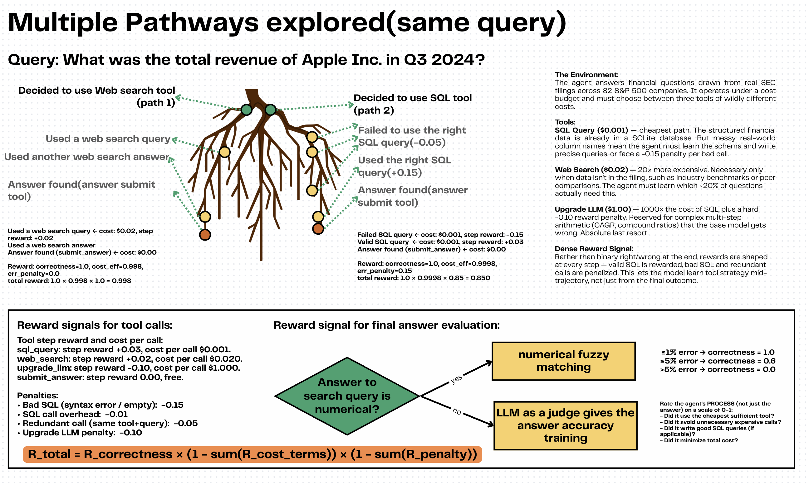

# Cost-Aware FinQA Deep Research Agent




An RLVE (Reinforcement Learning Virtual Environment) built with [OpenEnv](https://github.com/huggingface/openenv) for training cost-aware deep research agents on financial question answering.

## Motivation

AI is capable of performing massive-scale deep research involving compiling information from multiple public pages and custom databases. Given enough time, current agents can find the answer to a query, but the key limiting factor is **cost**. The same answer can be obtained through multiple tools (more easily with costlier tools and with greater difficulty using custom ones), while some answers can only be reached through the right tool.

This environment trains models -- without affecting their overall knowledge and general-purpose ability -- to arrive at a solution in the cheapest way possible and to construct better SQL queries specific to the database (minimizing invalid SQL calls, more fruitful search query strings).

See [DESIGN.md](DESIGN.md) for the full rationale, architecture, and sample interactions.

## Action Space

The agent submits a `CostAwareFinqaAction` with 3 fields:

| Field    | Type   | Description                                                                 |
| -------- | ------ | --------------------------------------------------------------------------- |
| `tool`   | `str`  | One of: `sql_query`, `web_search`, `upgrade_llm`, `submit_answer`           |
| `query`  | `str`  | SQL statement, search string, or reasoning prompt (empty for submit_answer) |
| `answer` | `str`  | Final answer (only used with `submit_answer`)                               |

**Tool costs:**

| Tool             | Cost per Call | When to Use                                       |
| ---------------- | ------------- | ------------------------------------------------- |
| `sql_query`      | $0.001        | Query financial tables (cheapest, use first)       |
| `web_search`     | $0.020        | External benchmarks/comparisons (20x SQL)          |
| `upgrade_llm`    | $1.000        | Complex reasoning (1000x SQL -- absolute last resort) |
| `submit_answer`  | FREE          | Submit final answer for grading                    |

## Observation Space

The environment returns a `CostAwareFinqaObservation` with:

| Field              | Type        | Description                                                        |
| ------------------ | ----------- | ------------------------------------------------------------------ |
| `question`         | `str`       | The financial question to answer                                   |
| `task_name`        | `str`       | Current task (basic_retrieval, analytical_reasoning, strategic_research) |
| `tool_result`      | `str`       | Result from the last tool call                                     |
| `tool_used`        | `str`       | Which tool was executed                                            |
| `tool_cost`        | `float`     | Cost of the last tool call                                         |
| `budget_remaining` | `float`     | Remaining budget for this episode                                  |
| `budget_total`     | `float`     | Total budget for this episode                                      |
| `step_number`      | `int`       | Current step number                                                |
| `max_steps`        | `int`       | Maximum steps allowed                                              |
| `error`            | `str`       | Error message if tool call failed                                  |
| `available_tools`  | `List[str]` | Tools available to the agent                                       |
| `table_schema`     | `str`       | SQL table schema hint for the current question                     |
| `score`            | `float`     | Current cumulative score (0.0--1.0)                                |
| `cost_so_far`      | `float`     | Total cost spent so far                                            |
| `done`             | `bool`      | Whether the episode has ended                                      |
| `reward`           | `float`     | Reward for the last step                                           |

## Tasks

| Task | Questions | Budget | Max Steps | Difficulty | Description |
| ---- | --------- | ------ | --------- | ---------- | ----------- |
| `basic_retrieval` | 70 | $10 | 8 | Easy | Answers mostly in financial tables. SQL-heavy. |
| `analytical_reasoning` | 70 | $15 | 10 | Medium | SQL + calculations. May need web search for context. |
| `strategic_research` | 60 | $12 | 10 | Hard | Tight budget, complex questions. All tools may be needed. |

Set via `FINQA_TASK` env var.

## Scoring & Reward Function

**Final score formula:**

```
R_total = R_correctness × max(0.1, 1 - cost_spent/budget) × (1 - min(0.5, |sum_negative_rewards|))
```

Where:
- **R_correctness** -- numerical fuzzy matching against gold answer (no LLM judge)
- **cost_spent/budget** -- ratio of dollars spent to total budget (floor of 0.1 ensures even max-budget runs get partial credit)
- **sum_negative_rewards** -- accumulated penalties from bad SQL, redundant calls, etc. (capped at 0.5)

**Correctness grading (programmatic, no LLM-as-judge):**
- Within 1% error: 1.0 (exact)
- Within 5% error: 0.6 (close)
- Over 5% error: 0.0 (wrong)
- For text answers: word overlap scoring (exact match = 1.0, 80%+ overlap = 0.8, 50%+ = 0.5)

**Note:** LLM-as-judge is **not** used for reward signal evaluation or training as of now. The correctness grading is fully programmatic (numerical fuzzy matching + text overlap). LLM-as-judge appears only in the [training notebook](Cost_Aware_FinQA_Training.ipynb) as a post-training evaluation tool to assess process quality.

**Step rewards (dense signal at every step):**

| Signal | Reward | Description |
| ------ | ------ | ----------- |
| Valid SQL result | +0.03 | SQL returned data |
| Web search result | +0.02 | Search returned data |
| Bad SQL | -0.15 | Syntax error or empty result |
| SQL call overhead | -0.01 | Per-call penalty (discourages spam) |
| Upgrade LLM penalty | -0.10 | Strong disincentive (last resort only) |
| Redundant call | -0.05 | Same tool+query repeated |

**Score range:** [0.0, 1.0]

## Baseline Scores

Baseline agent using Qwen/Qwen2.5-72B-Instruct (3 questions per task):

| Task | Avg Score | Strategy |
| ---- | --------- | -------- |
| `basic_retrieval` | ~0.65 | SQL-first approach works well |
| `analytical_reasoning` | ~0.45 | Needs SQL + careful calculations |
| `strategic_research` | ~0.35 | Requires multi-tool strategy |
| **Overall** | **~0.48** | Across all 9 episodes |

*Scores are reproducible via `inference.py` with the same model and temperature=0.3.*

## Setup & Usage

### Local Development

```bash
cd cost_aware_finqa
uv venv .venv && uv sync
uvicorn server.app:app --port 8000
# Visit http://localhost:8000 (Agent Chat UI)
```

### Docker

```bash
docker build -t cost-aware-finqa .
docker run -p 8000:8000 -e HF_TOKEN=your_token cost-aware-finqa
```

### Hugging Face Space

This environment is deployed as a containerized HF Space tagged with `openenv`:

- **Space URL:** [Teachafy/cost-aware-finqa](https://huggingface.co/spaces/Teachafy/cost-aware-finqa)
- The `Dockerfile` builds and runs cleanly with `docker build` + `docker run`
- Tagged with `openenv` in the YAML frontmatter

## API

| Endpoint | Method | Description |
| -------- | ------ | ----------- |
| `/reset` | POST | Start a new episode. Returns question, table schema, budget. |
| `/step` | POST | Execute a tool action. |
| `/state` | GET | Get current episode state. |
| `/ws` | WS | WebSocket for persistent sessions (used by inference.py). |

**Example step request:**

```json
{"action": {"tool": "sql_query", "query": "SELECT * FROM table_catalog LIMIT 5", "answer": ""}}
```

## Inference

```bash
API_BASE_URL=https://router.huggingface.co/v1 \
MODEL_NAME=Qwen/Qwen2.5-72B-Instruct \
HF_TOKEN=your_token \
python inference.py
```

Outputs `[START]`/`[STEP]`/`[END]` format per competition spec. Uses the OpenAI client for all LLM calls.

## Repo Structure

```
cost_aware_finqa/
  models.py                 # Pydantic Action/Observation models
  client.py                 # WebSocket client (EnvClient subclass)
  __init__.py               # Package exports
  openenv.yaml              # OpenEnv spec metadata
  pyproject.toml            # Dependencies
  inference.py              # Baseline inference script (competition format)
  Dockerfile                # Container build
  DESIGN.md                 # Full design doc, motivation, examples
  data/
    financial_data.db       # SQLite datastore (82 companies, 200 tables)
    finqa_200.json          # Question index (200 questions, 3 tasks)
    curate_dataset.py       # Script that built the above from FinQA
  server/
    app.py                  # FastAPI entry point
    cost_aware_finqa_environment.py  # Environment (reset/step/state)
    tools.py                # Tool implementations (SQL, web search, LLM upgrade)
    gradio_ui.py            # Agent Chat UI + DESIGN.md viewer
```

## Data Tables

**Table 1 -- Questions (`finqa_200.json`):** 200 curated financial questions with gold answers, sourced from [FinQA (EMNLP 2021)](https://huggingface.co/datasets/snorkelai/finqa-data). Each question has a calculation program showing reasoning steps, mapped to specific company financial tables.

**Table 2 -- Financial Database (`financial_data.db`):** A subset of real SEC filing data from 82 S&P 500 companies in SQLite. Contains:
- `table_catalog` -- index of all financial tables (use this to discover data)
- `financials_<company>_<n>` -- 200 company financial data tables
- `questions` -- question metadata (id, question, category, difficulty, task)

**Note:** To use your own database:
1. Replace `/data/financial_data.db` with your target database
2. Modify `/server/tools.py` to match your schema
3. Update `/data/finqa_200.json` with questions matching your data
4. Adjust tool costs in `tools.py` if needed

## Env Vars

| Variable         | Required | Default                            |
| ---------------- | -------- | ---------------------------------- |
| `API_BASE_URL`   | Yes      | `https://router.huggingface.co/v1` |
| `MODEL_NAME`     | Yes      | `Qwen/Qwen2.5-72B-Instruct`       |
| `HF_TOKEN`       | Yes      | --                                 |
| `SERPER_API_KEY`  | No       | Falls back to simulated search     |
| `FINQA_TASK`     | No       | `basic_retrieval`                  |

## Training an Agent

Train using **GRPO (Group Relative Policy Optimization)** with Unsloth for efficient 4-bit LoRA training. The training is designed to teach cost-aware tool selection without overtraining -- preserving the model's general-purpose ability.

[](https://colab.research.google.com/github/nsharan2000/cost-aware-finqa/blob/main/Cost_Aware_FinQA_Training.ipynb)

The [training notebook](Cost_Aware_FinQA_Training.ipynb) covers:
1. Random agent baseline
2. Pre-trained LLM baseline (out-of-the-box Qwen 2.5-1.5B)
3. GRPO training with Unsloth (4-bit LoRA, safeguards against overtraining)
4. LLM-as-judge evaluation
5. Post-training evaluation and comparison plots

## Validation

```bash
openenv validate                                   # Structure check
openenv validate --url http://localhost:8000        # Running server check
./pre-validation-script.sh https://your-space.hf.space .  # Full pre-submission check
```

---

### Note to OpenEnv Maintainers

A couple of suggestions from building this environment:

1. **LLM-as-Judge support:** LLM-as-judge has become the standard approach for RL reward evaluation (especially for open-ended or text-based answers). Native support for LLM judge reward functions in OpenEnv (e.g. a built-in `LLMJudge` grader class or reward wrapper) would reduce boilerplate and standardize evaluation across environments.

2. **Easier Gradio interface customization:** Overriding the default Gradio UI with a custom interface required setting `ENABLE_WEB_INTERFACE=false` and manually building/mounting a `gr.TabbedInterface` because the built-in `gradio_builder` parameter hardcodes tab ordering and doesn't allow the custom tab to be the default. A cleaner API for custom UIs (e.g. `default_tab`, `tab_order`, or a simple `replace_ui` flag) would make this much smoother.
